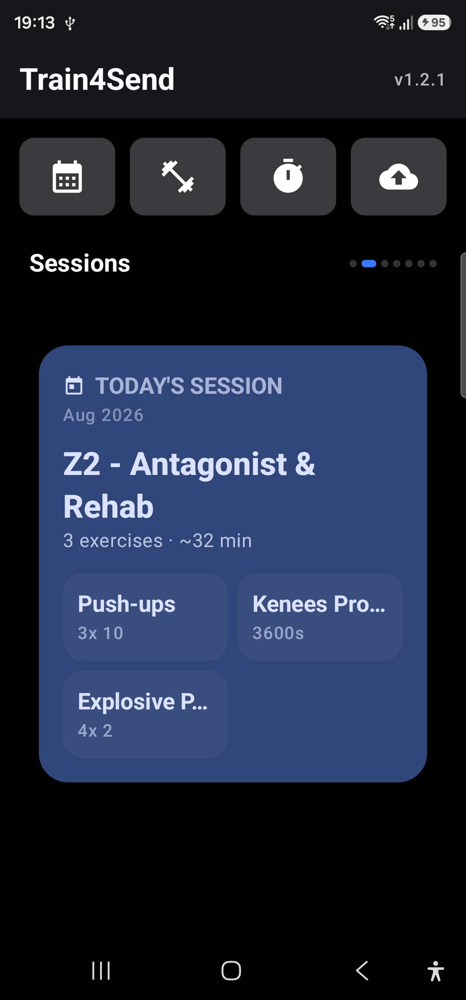
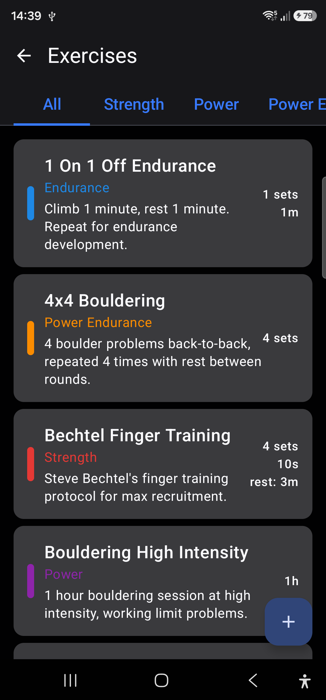
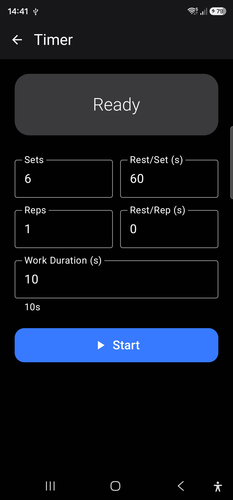

# Train2Send — Climbing Training App

A native Android app (Kotlin + Jetpack Compose) to schedule, execute, and track climbing training programs. Fully configurable — no hardcoded routines. Made with AI.

## Screenshots







## Training Categories

| Category | Color | Purpose |
|----------|-------|---------|
| **Endurance** | 🔵 | Aerobic capacity (ARC, 4x6, 1-on-1-off) |
| **Power Endurance** | 🟠 | Anaerobic intervals (Intensive Triples, 8-set circuits) |
| **Strength** | 🔴 | Max finger strength, low rep pulling |
| **Power** | 🟣 | Explosive contact strength, dynos |
| **Mobility & Recovery** | 🟢 | Stretching, CARs, tissue care |
| **Antagonist & Core** | 🔵 | Push-ups, TRX, shoulder stability |

## Exercise Sections

Each exercise assigned to a day has a **section** that indicates its role in the session:

| Section | Purpose |
|---------|---------|
| **Main** | Primary focus of the day |
| **Secondary** | Supporting work that complements the main goal |
| **Complementary** | Warm-up, cool-down, prehab, or accessory work |

## How it works

The app includes a few mock plans and exercises to get you going, but everything is fully customizable.

1. **Create exercises** — Define the exercises you train (e.g. pull-ups, hangboard repeaters, ARCs).
2. **Build a plan** — Assemble exercises into a weekly training plan, assigning them to specific days.
3. **Activate a plan** — Only one plan is active at a time. The main screen shows today's exercises from that plan.
4. **Swipe through the week** — Swipe left/right on the main screen to preview upcoming or past days.
5. **Run a workout** — Tap any exercise to see its details and start a session using the built-in timer.

Each plan covers a single week. For multi-week programs, create a separate plan for each week and activate them in sequence.

## Theme

The app supports Light, Dark, and System theme modes. Toggle between them from the main screen - upper right corner icon.

## Import & Export

All your data (exercises + plans) can be exported to a single JSON file and imported back later. This is useful for backups, sharing plans with friends, or moving data between devices.

- **Export** — Saves everything to a `.json` file or shares it directly via any app (email, messaging, cloud storage).
- **Import** — Loads a previously exported JSON file. Existing data with the same IDs gets overwritten; everything else is left untouched.

The JSON format is human-readable, so you can also hand-edit plans in a text editor and import them into the app. See `app/src/main/assets/demo_climbing_plans.json` for a working example.

## Architecture

```
[ UI Layer — Jetpack Compose + Material 3 ]
                    │
[ ViewModel Layer — StateFlow / Events ]
                    │
[ Domain Layer — Timer Engine / Use Cases ]
                    │
[ Data Layer — Room DB / Repositories ]
```

**Stack:** Kotlin 2.0 · Compose BOM 2024.06 · Room · Navigation Compose · Material 3

## Build & Run

```bash
./gradlew assembleDebug
```

Requires Android Studio Koala+ / AGP 8.5+ / JDK 17

Min SDK: 26 (Android 8.0) · Target SDK: 35

## License

This project is licensed under the [GNU General Public License v3.0](LICENSE).
